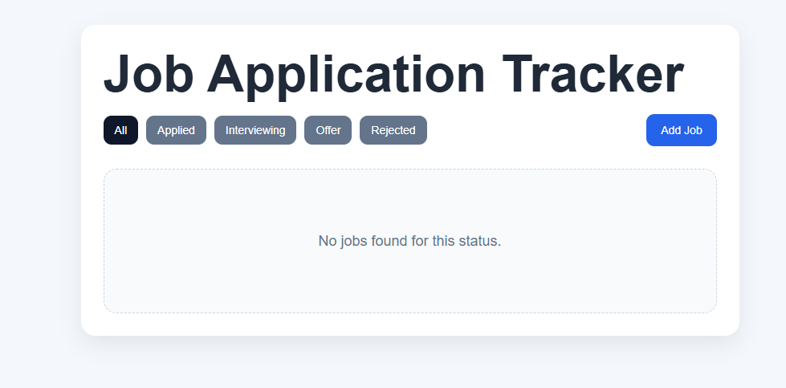
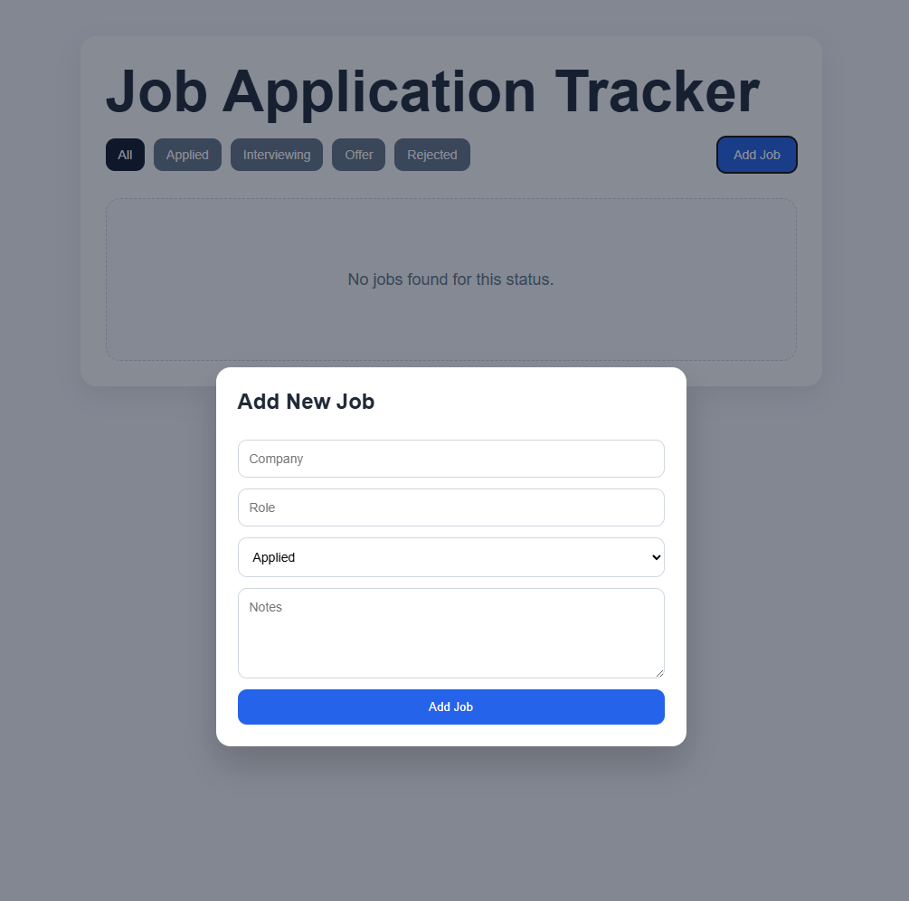
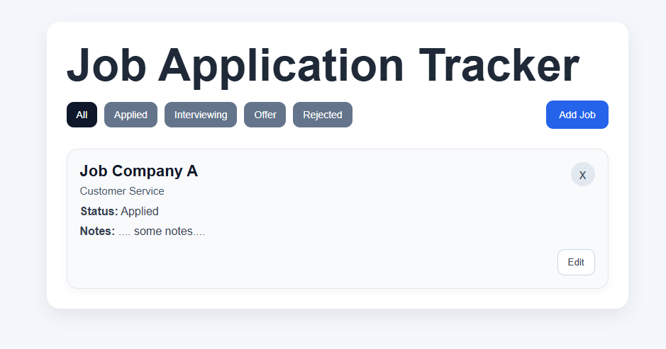
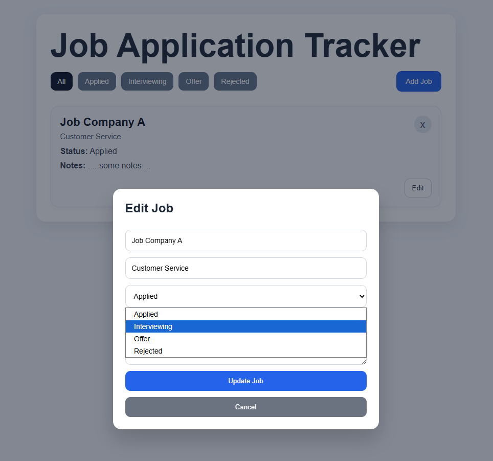
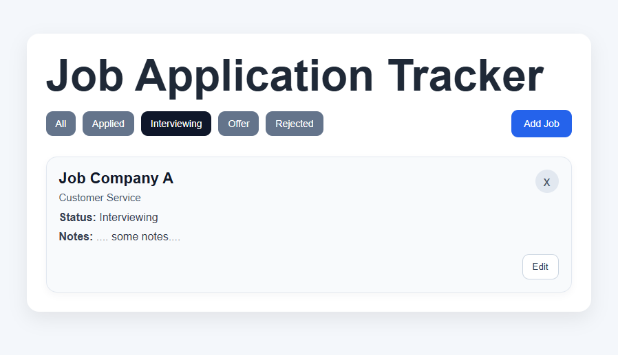

# Job Application Tracker

A full-stack job application tracking app built with React, Node.js, Express, and MongoDB. Users can add, edit, delete, and filter job applications by status through a clean modal-based interface.



## Live Demo
url

## Features

- Add new job applications
- Edit existing applications
- Delete applications
- Filter jobs by status
- Modal-based add/edit form
- Full-stack CRUD functionality
- MongoDB persistence

## Tech Stack

### Frontend
- React
- Vite
- CSS

### Backend
- Node.js
- Express
- MongoDB
- Mongoose

## Project Structure

```text
job-tracker/
├── client/
├── server/
└── README.md
```

## Screenshots

### Adding a Job


### Viewing Lists of Jobs


### Editing a Job


### Filtering Jobs.


## Getting Started

```bash
## 1. Clone the repository.

git clone https://github.com/punch2dface/Job-Application-Tracker.git
cd job-tracker

## 2. Install frontend dependencies.

cd client
npm install

## 3. Install backend dependencies

cd ../server
npm install

## 4. Set up backend environemtn variables

### Create a .env file inside the server folder and add:

MONGODB_URI=your_mongodb_connection_string
PORT=5000

## 5. Start the backend server

cd server
npm start

## 6. Start the frontend app

### Open a second terminal:

cd client
npm run dev

### Then open the lcoal URL shown by Vite, usually:

http://localhost:5173
```

## API Endpoints

- GET /jobs - Fetch all jobs
- POST /jobs - Create a job
- PUT /jobs/:id - Update a job
- DELETE /jobs/:id - Delete a job

## What I Learned

This project helped me practice:

- Building a full-stack CRUD app
- Creating REST API routes with Express
- Connecting MongoDB with Mongoose
- Managing frontend state in React
- Reusing one modal form for both add and edit flows
- Structuring a larger project into reusable frontend components

## Future Improvements

- Add authentication
- Add job search
- Add sorting by date or company
- Add status badges with custom colors
- Improve mobile responsiveness further

## Please Note

This project uses a shared MongoDB database. 
All users interact with the same dataset, so entries may persist between sessions.